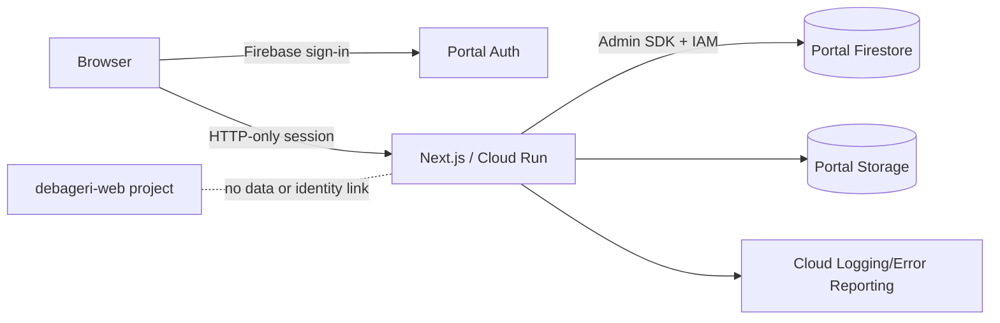
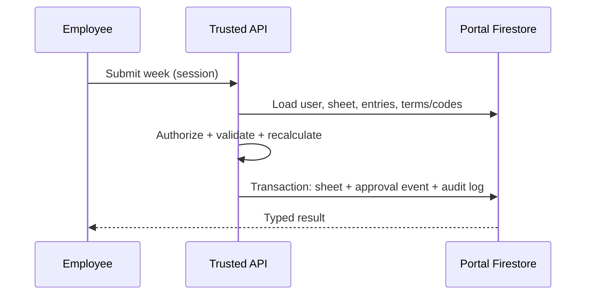

# Architecture

## Overview

Next.js App Router serves responsive React UI and trusted route handlers. Firebase client SDK handles sign-in only; an ID token is exchanged for a secure, HTTP-only session cookie. Server code uses Firebase Admin and a portal-only runtime identity. Firestore is the primary database and Storage is reserved for future private employee documents.

Client components own interactive input state; domain modules own dates, durations, validation, status transitions, authorization predicates, and aggregation. Server services load current state, authorize, validate, transact, and append approval/audit events. Repositories can later abstract Firestore further without changing UI contracts.

## Flows

Authentication verifies the Firebase session cookie with revocation checking and loads the active Firestore user. Submission loads the sheet and entries, validates ownership/status, recalculates totals, changes status transactionally, and appends events. Review additionally verifies manager assignment or admin role. Reporting queries top-level entries by organization/user/date and aggregates through a replaceable reporting service.

Errors use stable public messages and avoid internal details. Structured logs should carry correlation ID, action, actor ID, organization ID, result, and error class, but not entry comments or employee details. Cloud Run is recommended for standalone Next.js; Firebase Hosting may proxy it. App Check, rate limiting, monitoring, alerts, PITR/export backups, and retention policies are production gates.

Top-level collections support manager/report queries and future summary jobs. Precomputed `reportSummaries` can be introduced behind the reporting service. Payslips/documents use separate private Storage paths plus metadata in future collections. No architecture dependency is time-reporting-specific.
